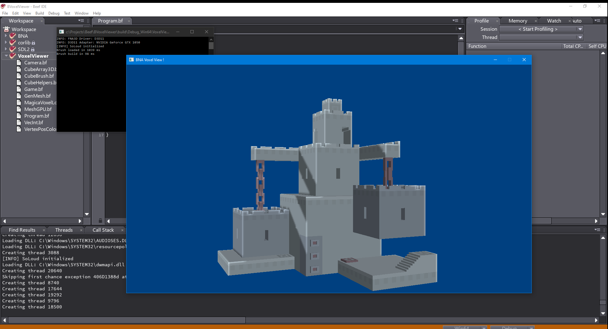

# BVoxelViewer
Voxel Viewer using BeefLang and BNA

This is a sample to import a magicaVoxel's file format and rendered using BNA.

BeefLang
https://www.beeflang.org/

BNA is a FNA3D binding
https://github.com/KillaMaaki/BNA.git

